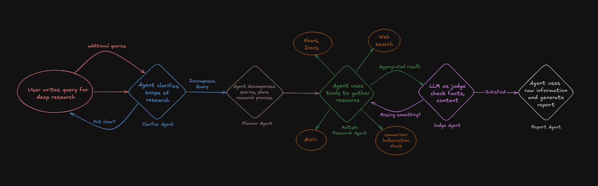
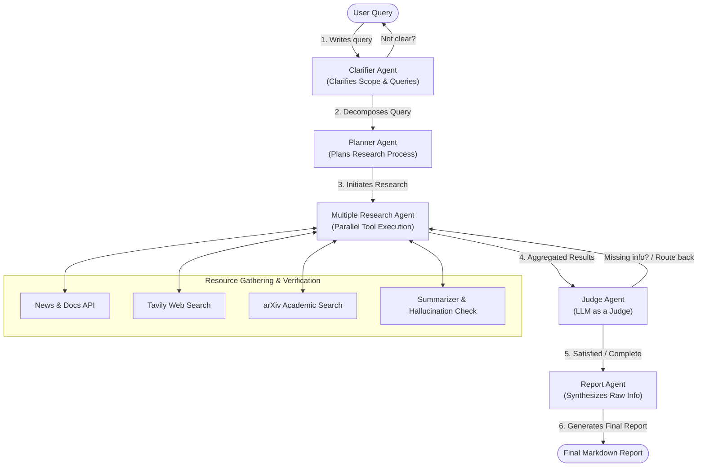

# Deep Research Agent

An advanced, multi-agent research pipeline powered by LangGraph, LangChain, and Google Gemini. This system automates the process of deep academic and web research, verifying sources, checking for hallucinations, and synthesizing a comprehensive final report.

---

## 🏗️ High-Level Design (HLD)

The system is designed as a multi-agent state graph using **LangGraph**, where individual specialized LLM agents communicate and collaborate to perform deep research.

### HLD Architecture Flowchart



### Mermaid Flow Diagram



---

## 🤖 Agent Roles & Workflows

### 1. Clarifier Agent
* **Role**: Evaluates the user's initial query for ambiguity, depth, and clarity.
* **Behavior**: If the query is too vague, it prompts the user for clarification. Once the scope is clear, it decomposes the user's intent into target objectives.

### 2. Planner Agent
* **Role**: Takes the structured research objectives and breaks them down into sub-queries.
* **Behavior**: Develops a step-by-step search plan detailing which tools to target (e.g. arXiv for papers, Tavily for current web events) and how to sequence the information retrieval.

### 3. Multiple Research Agent
* **Role**: A multi-faceted executor that runs searches and retrieves documents in parallel.
* **Behavior**: Uses search APIs, queries PDF archives like arXiv, and processes news sources. It filters and summarizes the retrieved chunks while executing verification checks to ensure no hallucinated claims are ingested.

### 4. Judge Agent
* **Role**: Acts as a quality controller and evaluator.
* **Behavior**: Inspects the aggregated context gathered by the Research Agent. If there are unresolved gaps or contradictory information, it directs the Research Agent to search further. If all requirements are met, it signs off on the data.

### 5. Report Agent
* **Role**: Synthesizes the validated context.
* **Behavior**: Writes the final markdown report containing detailed analyses, source citations, and structured tables or summaries.

---

## 🛠️ Tech Stack & Dependencies

* **Language**: Python >= 3.14
* **Orchestration**: `langgraph` (v1.2+) - For stateful agent graph routing and cyclic loops
* **Core Agent Framework**: `langchain` & `langchain-core` - For prompt management and model integration
* **LLM Provider**: `langchain-google-genai` (Google Gemini) - High context window and reasoning capabilities
* **Information Gathering**: `tavily-python` - For optimized, agent-friendly web search
* **Validation**: `pydantic` - Type checks and structured output validation

---

## 📂 Project Structure

```bash
├── HLD.png                 # System design architecture diagram
├── README.md               # Project documentation and HLD
├── main.py                 # Application entrypoint
├── pyproject.toml          # Project configuration & dependencies
├── uv.lock                 # UV package manager lockfile
└── src/
    ├── agents/             # Agent role definitions & logic
    ├── graph/              # LangGraph compilation & routing logic
    ├── prompts/            # System and instruction prompts
    └── tools/              # Tavily search, arXiv fetcher, & summarizer utilities
```

---

## 🚀 Getting Started

### 📋 Prerequisites
Ensure you have the `uv` package manager installed:
```bash
pip install uv
```

### ⚙️ Installation & Setup

1. **Clone the repository and navigate to the project directory:**
   ```bash
   cd Deep-research
   ```

2. **Create a virtual environment and install dependencies:**
   ```bash
   uv sync
   ```

3. **Configure environment variables:**
   Create a `.env` file in the root directory:
   ```env
   GOOGLE_API_KEY=your_gemini_api_key
   TAVILY_API_KEY=your_tavily_api_key
   ```

4. **Run the application:**
   ```bash
   uv run main.py
   ```
